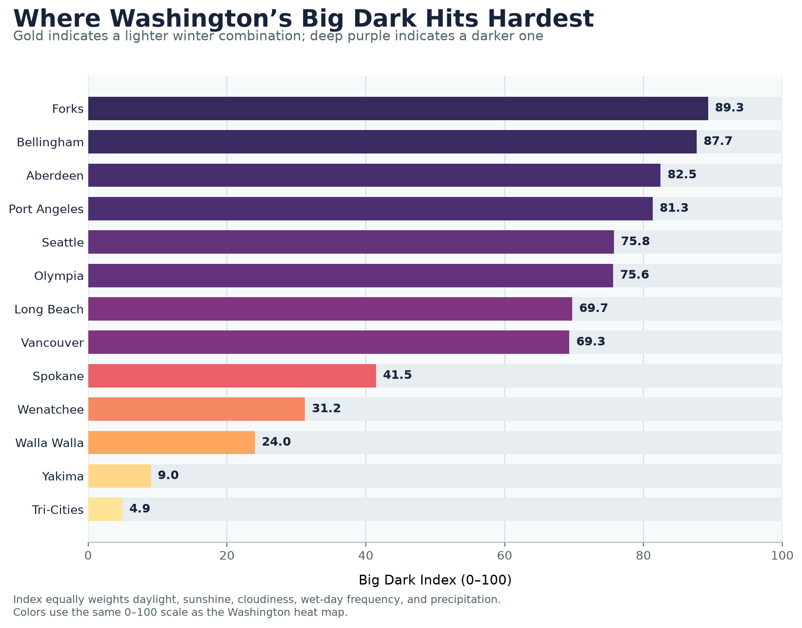

# Washington Big Dark Index

How different is winter darkness across Washington?

Washington's "Big Dark" is usually described as one statewide experience, but
Forks and the Tri-Cities do not have the same winter. This project compares 13
communities using daylight, sunshine, cloudiness, and precipitation to find where
the combination is most severe.



## Findings

- Forks ranks first with a Big Dark Index of 89.3, followed by Bellingham at 87.7
  and Aberdeen at 82.5.
- Olympia and Seattle are nearly tied at 75.6 and 75.8.
- Scores fall sharply east of the Cascades. Spokane ranks ninth at 41.5, while
  Yakima and the Tri-Cities have the two lowest scores.
- Bellingham and Port Angeles rank higher than rainfall alone would suggest
  because the index also accounts for their shorter northern daylight.

## Method

The analysis covers 14 complete November-through-February winters from 2006 to
2020. Daily weather estimates were collected for one coordinate in each community.

The 0–100 index gives equal weight to five min-max-scaled components:

1. Average daylight hours, with fewer hours scored as darker
2. Average sunshine hours, with fewer hours scored as darker
3. Sunshine as a percentage of available daylight, with a lower share scored as
   cloudier
4. Percentage of days receiving at least 1 millimeter of precipitation
5. Average total precipitation per winter

Scores are relative to the 13 communities in this project. They are not official
climate classifications.

## Data and tools

Historical weather data come from the
[Open-Meteo Historical Weather API](https://open-meteo.com/en/docs/historical-weather-api)
using the ERA5 reanalysis model.

- Python and pandas for data collection, cleaning, streak calculations, and scoring
- SQLite and SQL for winter-level aggregation
- Matplotlib for the ranking visualization
- Git and GitHub for version control and reproducibility

## Repository structure

```text
data/
  locations.csv                 Community names and coordinates
  processed/
    big_dark_summary.csv        Final measurements, component scores, and ranking
  raw/                          Recreated locally and excluded from version control
images/
  big_dark_ranking.png          Primary result visualization
scripts/
  download_weather.py           Reproducible API download
  analyze_big_dark.py           SQL aggregation and index calculation
  create_chart.py               Ranking chart generation
sql/
  winter_summary.sql            SQL used to summarize winter conditions
requirements.txt                Required Python packages
```

## Reproduce the analysis

```bash
pip install -r requirements.txt
python scripts/download_weather.py
python scripts/analyze_big_dark.py
python scripts/create_chart.py
```

## Limitations

ERA5 is a gridded reanalysis product rather than a collection of observations from
weather stations inside each city. The selected coordinate represents one point,
not every microclimate within a community. Index values also depend on the selected
locations, variables, scaling method, and equal weighting. The results are best
interpreted as a transparent comparison, not a definitive measure of winter quality.
